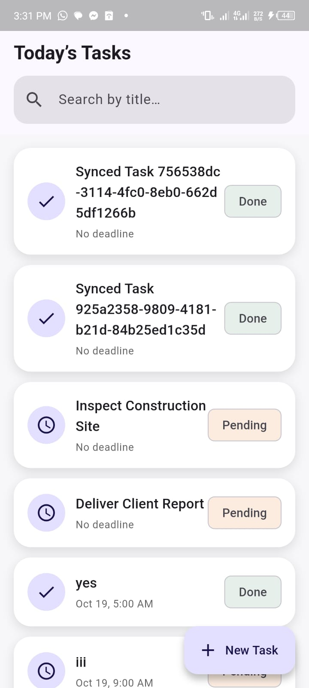
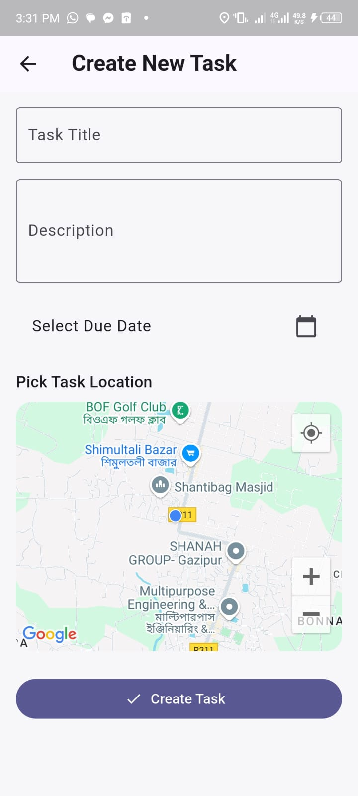
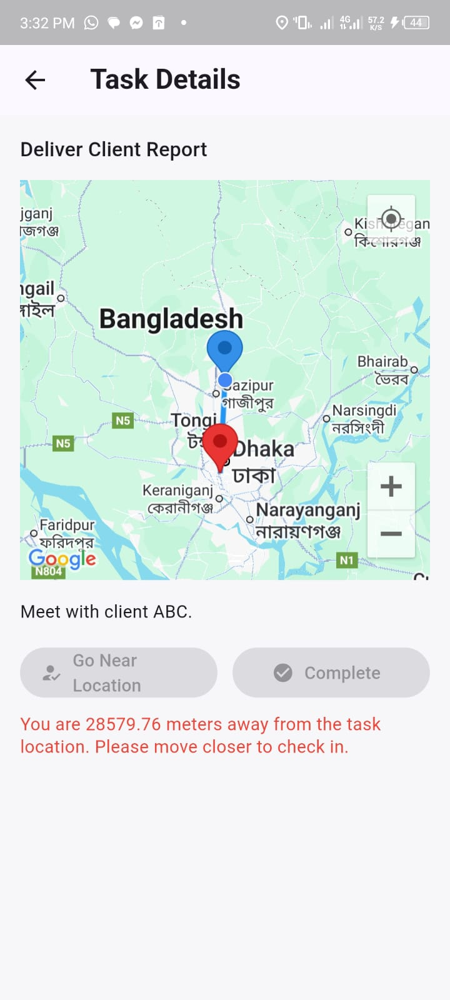

# 🛰️ Neos Coder — Field Task Management App

A Flutter demo built with **Repository Pattern**, **Provider** for state management, and **get_it** for dependency injection.  
Designed for an offline-first experience with **SQLite local cache**, **mock remote API**, and **Google Maps** integration.

---

## 📱 App Flow & Feature Summary

### Home / Task List
- Lists all field tasks with search & pagination.
- Displays a **red offline banner** when network is unavailable.
- Always loads from **local DB** (source of truth).
- Pull-to-refresh updates local cache from mock remote when online.

### Task Detail Page
- Embedded **Google Map** showing:
    - 🔴 Task location
    - 🔵 My live location (updates in real-time)
    - A connecting polyline between them
- Live distance calculation → enables **Check In** when within 100 m.
- **Complete** button available only to the assigned user.
- Auto camera tracking as user moves.

### Create Task
- Simple form (title, description, due date, map pin selector).
- Saves instantly to local DB → visible offline.
- Syncs automatically when network returns.

---

## 🌐 Offline & Sync Strategy

| Action | When Offline | When Online |
|---------|--------------|-------------|
| **Create Task** | Saved locally with `isDirty = true` | Pushed to mock server → `isDirty = false` |
| **Check In / Complete** | Updates local row, marks dirty | Syncs to mock server and clears flag |
| **Read Tasks** | Loads from SQLite cache | Refreshes remote → updates local → reads local |

- `TaskRepositoryImpl` always **returns local data** (offline-first).
- `sync()` runs when connectivity returns to replay pending actions.
- Mock remote auto-creates tasks that don’t yet exist (“Task not found” safe).

---

## 🧱 Architecture Overview
```
lib/
├── core/
│ ├── di/locator.dart # get_it setup
│ ├── network/{connectivity_service.dart, global_connectivity.dart}
│ ├── location/location_service.dart # Geolocator wrapper
│ └── utils/constants.dart
├── data/
│ ├── model/task_model.dart
│ ├── datasources/{task_local_ds.dart, task_remote_ds.dart}
│ └── repositories/task_repository_impl.dart
├── domain/
│ ├── entities/task_entity.dart
│ ├── repositories/task_repository.dart
│ └── usecases/
├── presentation/
│ ├── pages/{tasks_page.dart, task_detail_page.dart, create_task_page.dart}
│ ├── providers/{task_list_provider.dart, task_detail_provider.dart}
│ ├── widgets/
│ └── routes/{app_routes.dart, route_observer.dart}
├── services/{auth_service.dart, location_service.dart, sync_service.dart}
└── main.dart
```

### Key Decisions
- **Repository Pattern** for clean separation (UI ↔ Data ↔ Domain).
- **Local DB = Source of Truth** → resilient offline behavior.
- **Provider** manages reactive UI state.
- **get_it** injects all singletons (API, DB, connectivity, location).
- **connectivity_plus + ValueNotifier** for global online/offline banner.
- **geolocator** stream for continuous location + map updates.

---

## ⚙️ Build & Run

### Requirements
- Flutter ≥ 3.27
- Dart ≥ 3.5
- Android SDK 33+
- iOS 15+

```bash
flutter pub get
flutter pub run build_runner build --delete-conflicting-outputs   # if using freezed/json
flutter run
```

  

## Download APK
[Field Task.apk](Field%20Task.apk)[Field Task.apk](build%2Fapp%2Foutputs%2Fflutter-apk%2FField%20Task.apk)

